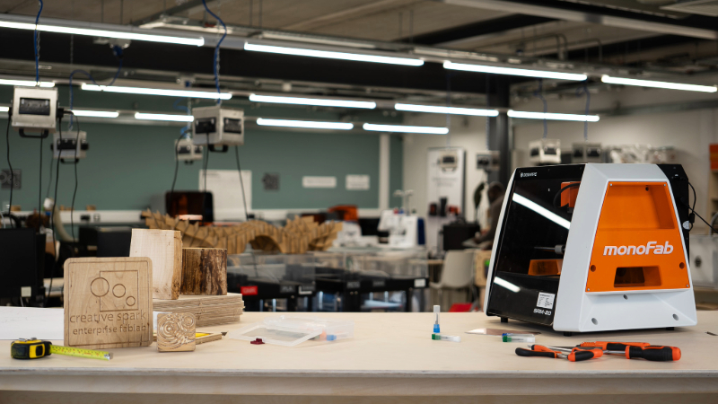

# [Creative Spark | Enterprise Fablab](https://creativespark.ie/fablab.html)

_💡If it’s not documented, it didnt happen” Diarmuid Kelly 2025_

 

We are a technical prototyping platform at [Creative Spark](https://creativespark.ie/) in Dundalk Co. Louth Ireland, with more than 200 sq. meters of full equipped space, digital fabrication machinery and power tools.

The Enterprise FabLab together with Creative Spark [Print Studio](https://creativespark.ie/print-studio.html), and [Downtown Hub](https://creativespark.ie/downtown-hub.html), we are a creative hubs that provide space, deliver supports and connect clusters.

***

## Students documentation

[Carl McAteer - Fab Academy](https://fabacademy.org/2025/labs/creativespark/students/carl-mcateer/)

[Diarmuid Kelly Fab Academy](https://fabacademy.org/2025/labs/creativespark/students/diarmuid-kelly/index.html)

[Fab Academy 2025 Thom Conaty](https://fabacademy.org/2025/labs/creativespark/students/thom-conaty/index.html)