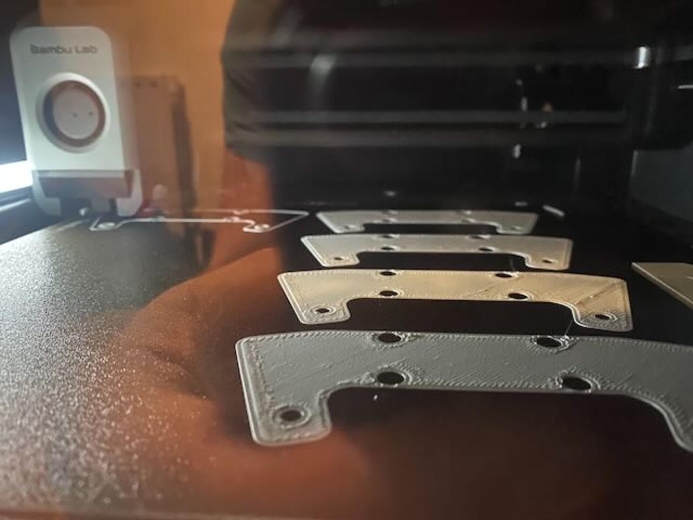

# Mechanical and machine design

&#x20;would💡Group assignment (part 1 of 2) - Mechanical design

* Design a [machine](http://machines.fabcloud.io/) that includes mechanism + actuation + automation + application
* Build the mechanical parts and operate it manually
* Document the group project

***

💡Group assignment (part 2 of 2) - Machine design

* Actuate and automate your machine
* Document the group project

***

### About this week 

> _Briefly describe the goal of the assignment. What are you characterizing, testing, or exploring_

Type here

***

### Tools and materials used 

> _Autodesk Fusion_
>
> _Onshape_
>
> _Prusa Slicer_
>
> _Ultimaker 2 (used for parts)_
>
> _Makerbot Replicator 2 (used for parts)_

* Type here

***

### Process and methodology 

> Describe step-by-step what the group did. Include sketches, screenshots, or videos if possible.

### **Mechanical Design (part 1 of 2)** 

We set out to design a rotational casting/moulding machine. We started with the initial sketches we had in our notebooks and digital sketching tools.

<figure><figcaption>
Some concept sketches Diarmuids notebook.
</figcaption></figure>

TODO

<figure><figcaption>
Carl doing some development sketches.
</figcaption></figure>

Diarmuid took Carl's concept sketches and worked up an initial CAD model in Autodesk Fusion

<figure><figcaption>
Using Sketch as Canvase in Autodesk Fusion
</figcaption></figure>

We used the Canvas feature in Autodesk Fusion to insert one of the selected concept sketches. This was calibrated to size so we could sketch to actual size. To do this, right-click on the canvas in the Fusion Br0wser and click calibrate. Select two points of known dimension and enter the desired dimension. Your canvas will now resize.

<figure><figcaption>
MakerBot Replicator 2 - disacembled 
</figcaption></figure>

Diarmuid took apart the Makerbot Replicator 2 and Carl took apart the Ultimaker 2. Both of these printers were donated machines - the replicator from South West College and the Ultimaker from Stweart Lawn from Manerhamilton Fab Lab  - thank you to both for donating the printers.

<figure><figcaption>
fig tag
</figcaption></figure>

We wanted to keep the design simple so as to reduce gears and drive shafts needed we wondered if it would be possible to bend the belt around the corner. Constrained by the belt sizes we had salvaged from the Makerbot and Ultimaker printers, we decided to pick the longest - the Replicator X axis belt. To confirm the size, we printed a ¼ section that was using the belt to drive around the corner. This initial test piece was too small.

<figure><figcaption>
First Laser Cut Size Test
</figcaption></figure>

We measured the belt a bit more accurately the second time and got something that moved. This would need to be refined and would also need a way of tensioning the belt. But we were happy to use this as  a drive mechanism.

<figure><figcaption></figcaption></figure>

<figure><figcaption>
fig tag
</figcaption></figure>

Think we need to add images here of the test laser cuts

We laser cut ¼ of the arm that was going to be used

TODO

<figure><figcaption>
fig tag
</figcaption></figure>

TODO

<figure><figcaption>
fig tag
</figcaption></figure>

TODO

TODO

<figure><figcaption>
fig tag
</figcaption></figure>

TODO

<figure><figcaption>
fig tag
</figcaption></figure>

TODO

<figure><figcaption>
fig tag
</figcaption></figure>

TODO

<figure><figcaption>
fig tag
</figcaption></figure>

TODO

<figure><figcaption>
fig tag
</figcaption></figure>

TODO

<figure><figcaption>
fig tag
</figcaption></figure>

TODO

<figure><figcaption>
fig tag
</figcaption></figure>

TODO

<figure><figcaption>
fig tag
</figcaption></figure>

TODO

<figure><figcaption>
fig tag
</figcaption></figure>

TODO

<figure><figcaption>
fig tag
</figcaption></figure>

TODO

<figure><figcaption>
fig tag
</figcaption></figure>

TODO

<figure><figcaption>
fig tag
</figcaption></figure>

TODO

<figure><figcaption>
fig tag
</figcaption></figure>

TODO

<figure><figcaption>
fig tag
</figcaption></figure>

TODO

<figure><figcaption>
fig tag
</figcaption></figure>

TODO

<figure><figcaption>
fig tag
</figcaption></figure>

TODO

<figure><figcaption>
fig tag
</figcaption></figure>

TODO

### **Machine Design (part 2 of 2)** 

Type here

***

### Group conclusions 

> **Findings:** \[What did you learn from the process?]

> **Challenges:** \[What issues did you encounter?]

> **Solutions:** \[How did you solve them?]

Type here

***

### Files 

> Add all files created for this group assignment

See below link to to files created this week:
