# Moulding and casting

💡

Group assignment

* Review the safety data sheets for each of your molding and casting materials
* Make and compare test casts with each of them
* Compare printing vs milling molds

***

### About this week 

> _Briefly describe the goal of the assignment. What are you characterizing, testing, or exploring_

Type here

***

### Tools and materials used 

> _List all the machines, software and materials used in this assigment._

_Carl:_

* Moulding - MBFG Duroflex 30 PU
* Casting - Jesmonite 100A
* Moulding Bonus: EVA Flex Vac Form using last weeks roto-casting machine.

***

### Process and methodology 

> Describe step-by-step what the group did. Include sketches, screenshots, or videos if possible.

Type here

### Jesmonite



<figure>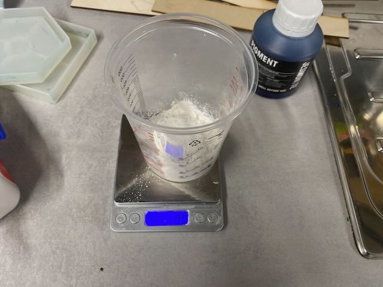<figcaption></figcaption></figure>

<figure>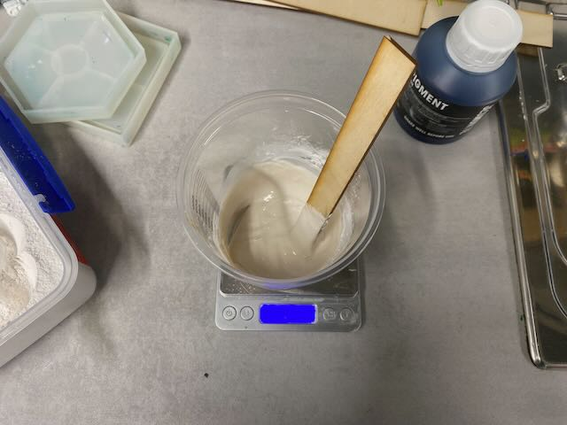<figcaption></figcaption></figure>

<figure>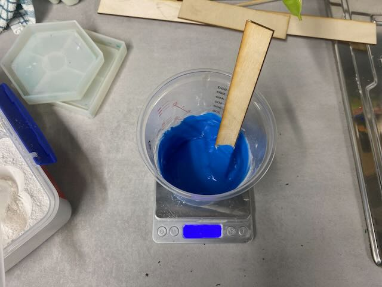<figcaption></figcaption></figure>

<figure>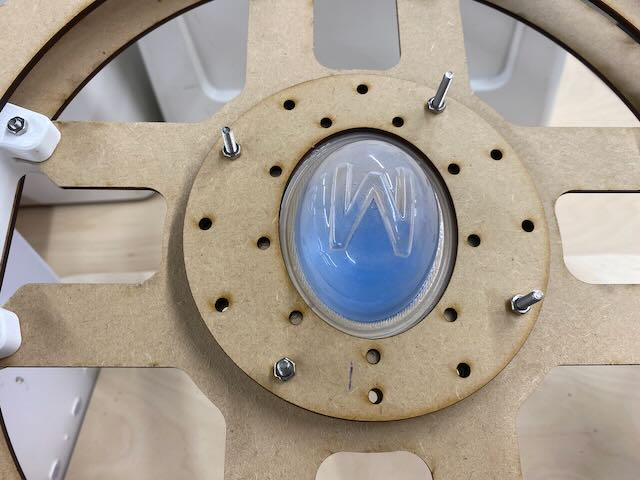<figcaption></figcaption></figure>

<figure>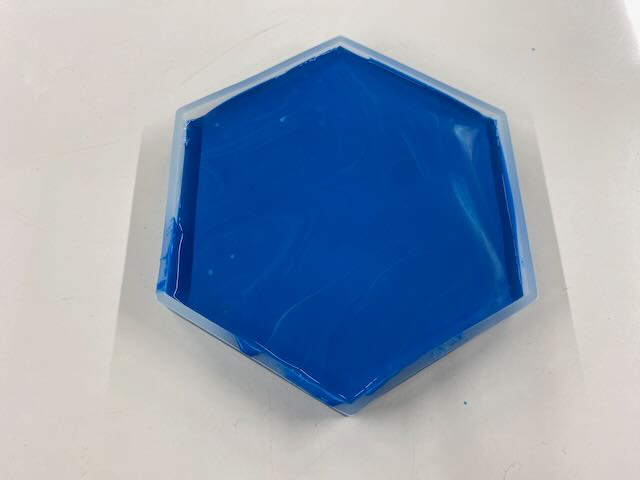<figcaption></figcaption></figure>

### Urethane Rubber

<figure>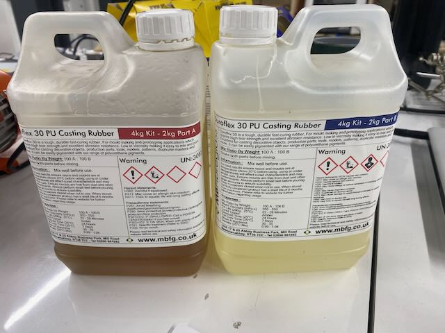<figcaption></figcaption></figure>





<figure>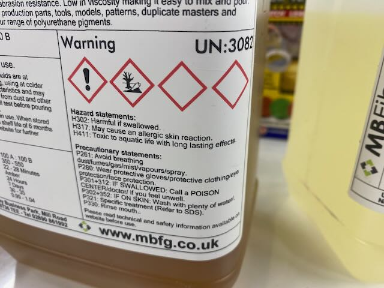<figcaption></figcaption></figure>

<figure>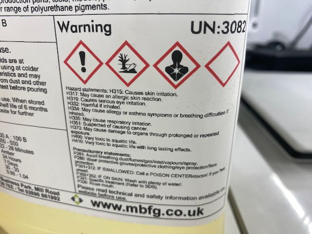<figcaption></figcaption></figure>

<figure>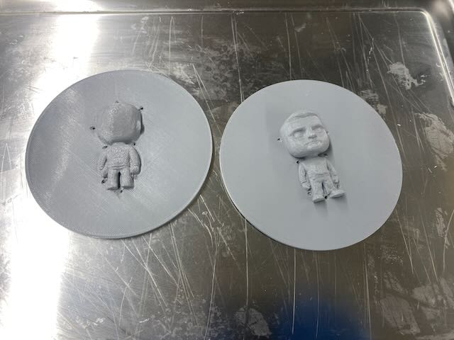<figcaption></figcaption></figure>

<figure>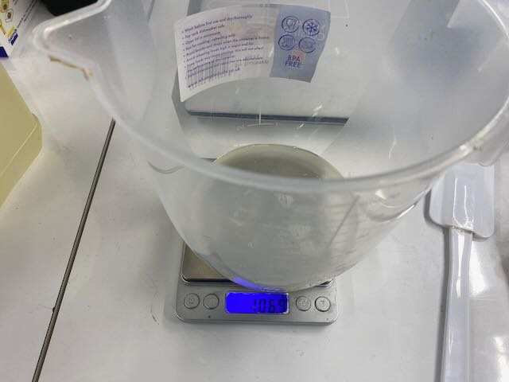<figcaption></figcaption></figure>

<figure>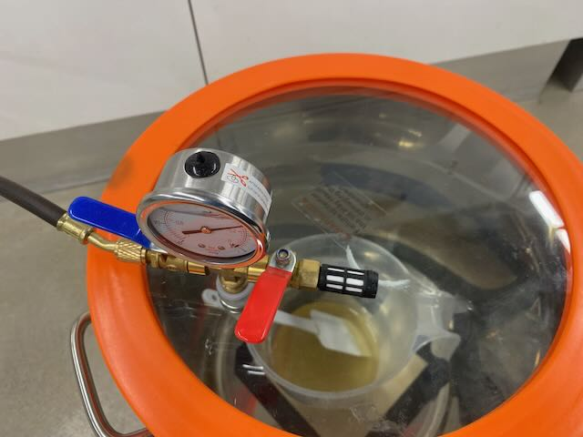<figcaption></figcaption></figure>

<figure>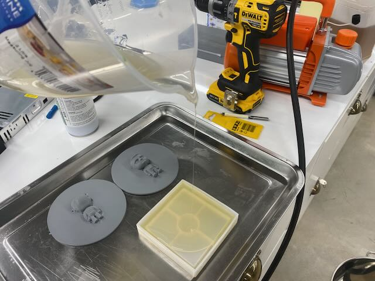<figcaption></figcaption></figure>

<figure>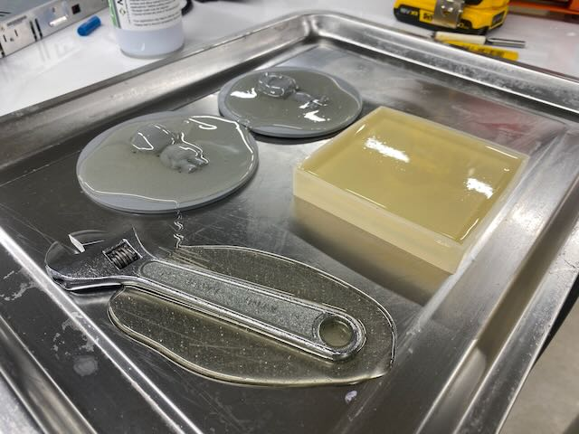<figcaption></figcaption></figure>

<figure>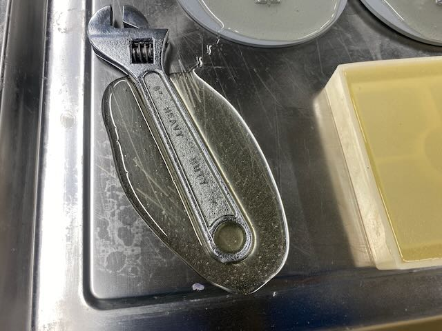<figcaption></figcaption></figure>

<figure>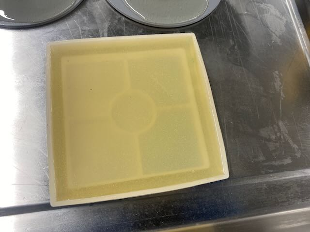<figcaption></figcaption></figure>

<figure>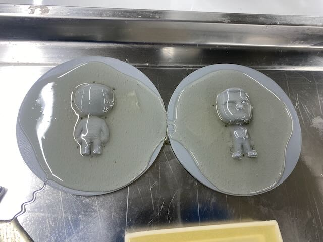<figcaption></figcaption></figure>

<figure><figcaption></figcaption></figure>

<figure><figcaption></figcaption></figure>

<figure><figcaption></figcaption></figure>

<figure><figcaption></figcaption></figure>

<figure><figcaption></figcaption></figure>

***

### Group conclusions 

> **Findings:** \[What did you learn from the process?]

> **Challenges:** \[What issues did you encounter?]

> **Solutions:** \[How did you solve them?]

Type here

***

### Files 

> Add all files created for this group assignment

See below link to to files created this week:
